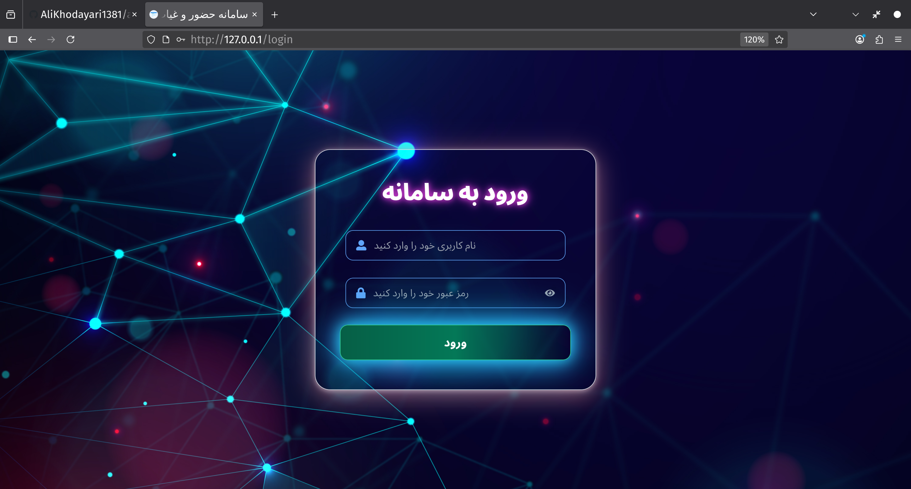
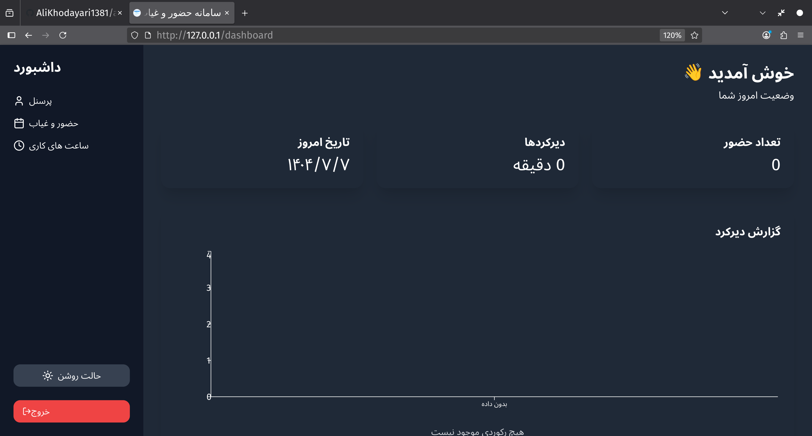
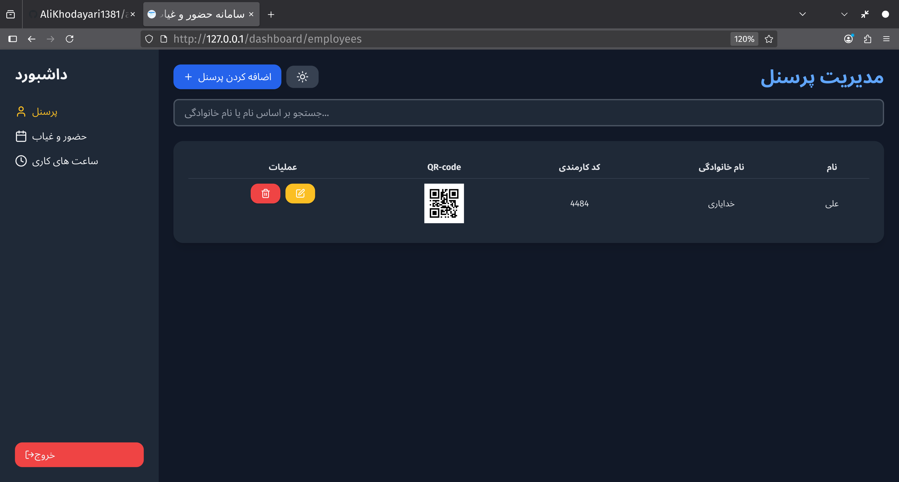
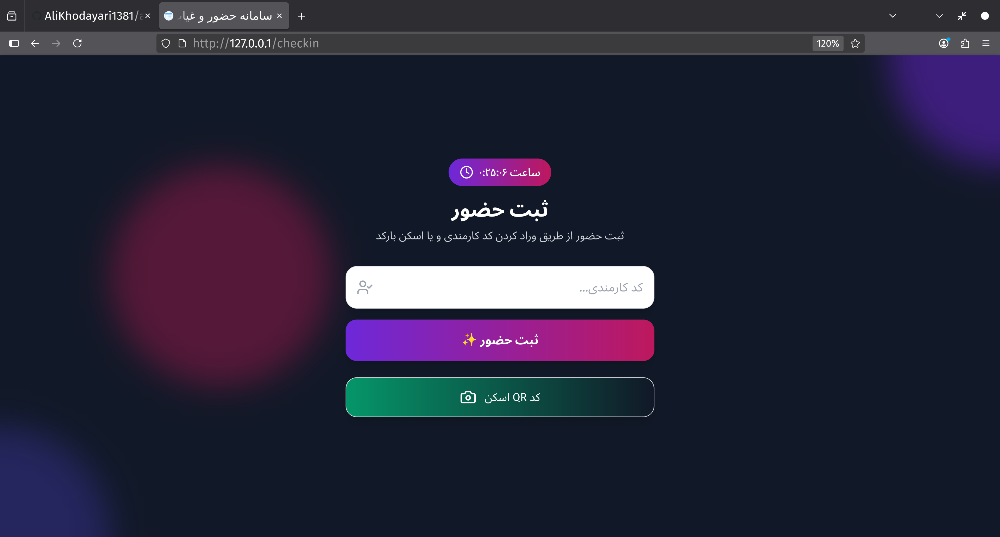

# Attendance QR Project
<div dir="rtl">

# سامانه حضور وغیاب با کد QR
</div>

این پروژه شامل بک‌اند Django و فرانت‌اند React و پایگاه داده PostgreSQL
 است که با Docker Compose قابل اجرا هستند.


 ## 🚀 اجرای پروژه با Docker Compose

### 1️⃣ پروژه را clone کنید

```bash
git clone https://github.com/AliKhodayari1381/attendance-qr.git

cd attendance-project
```

### 2️⃣ فایل محیطی اصلی را آماده کنید:

```bash
cp .env.example .env
# مقادیر لازم را تنظیم کنید
```

### 3️⃣ همه سرویس‌ها را بالا بیاورید:

```bash
docker-compose up -d --build
```
با این دستور ،  بک اند ، فرانت اند ، پایگاه داده ، سلری و ردیس برای کار های پس زمینه و nginx به صورت همزمان بالا می آیند وراه اندازی می شوند.

### 4️⃣ ساخت سوپر یوزر برای بک اند

```bash
docker-compose exec backend python manage.py createsuperuser
```

### 5️⃣ نتیجه

بک اند در آدرس زیر در دسترس خواهد بود :

```bash
http://0.0.0.0/admin
```

فرانت اند هم در آدرس های زیر در دسترس خواهند بود :

```bash
http://0.0.0.0/login

#صفحه مخصوص ادمین و یا مدیر سایت
```

```bash
http://0.0.0.0/checkin

#صفحه مخصوص کاربران عادی برای ثبت حضور 
```
### 🛑 توقف سرویس‌ها
```bash
docker-compose down
```

<div dir="rtl">

## 📦 ساختار پروژه

 attendance-project
<li>attendance-qr/ → بک‌اند Django</li>

<li>attendance-frontend/ → فرانت‌اند React</li>

<li>docker-compose.yml → تعریف سرویس‌ها</li>

<li>.env → متغیرهای محیطی</li>

</div>


<div dir="rtl">

## ⚡ <b>پیش‌نیازها</b>


  <li>Docker و Docker Compose نصب شده باشد</li>
  <li>Git نصب باشد</li>


</div>


<div dir="rtl">

<li><h2>🔒 SSL و Nginx</h2></li>

<p>برای فعال‌سازی HTTPS و دریافت SSL رایگان، به پوشه <code>Get_ssl/</code> مراجعه کنید.<br>
داخل این پوشه فایل پیکربندی Nginx و README مخصوص فعال‌سازی SSL موجود است.</p>

</div>


## 📸 پیش‌نمایش


## 


##


##

